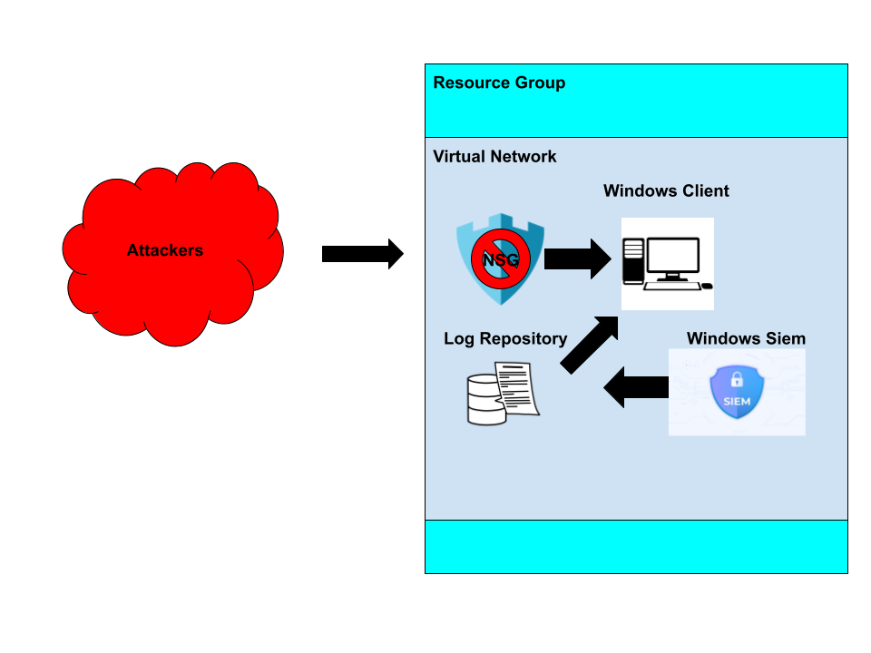
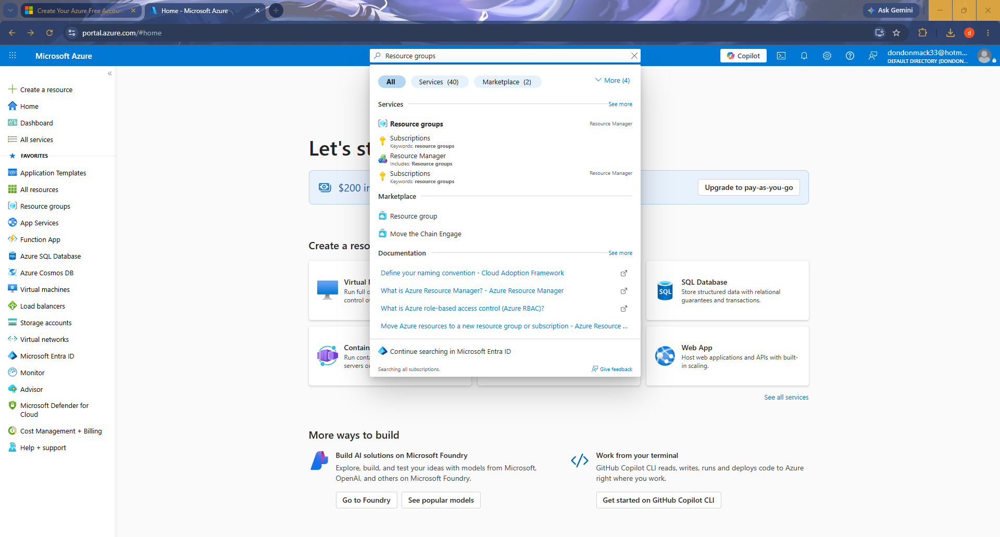
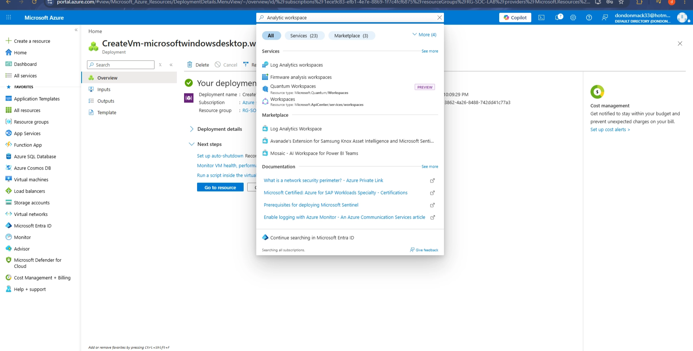
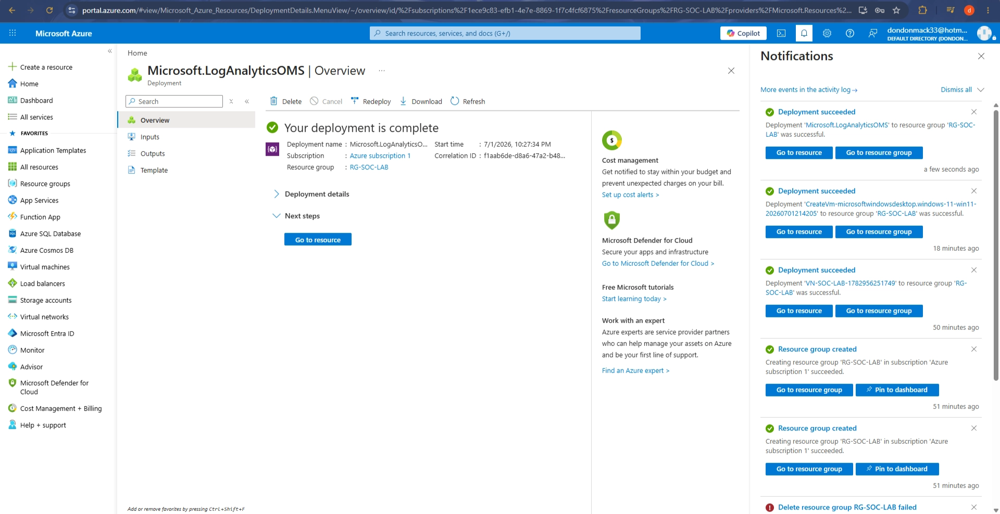
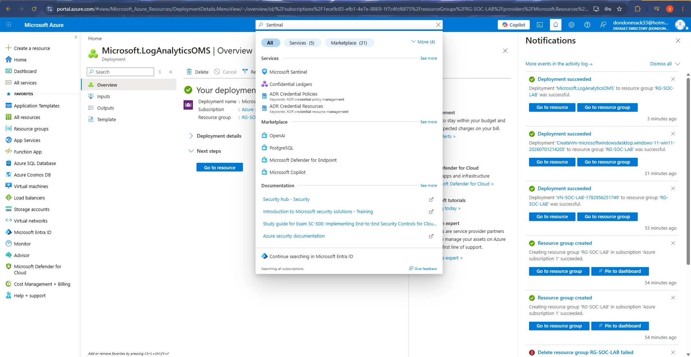
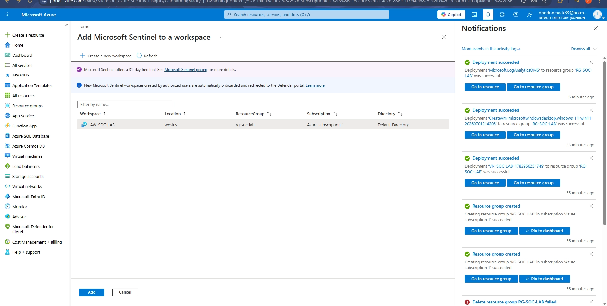
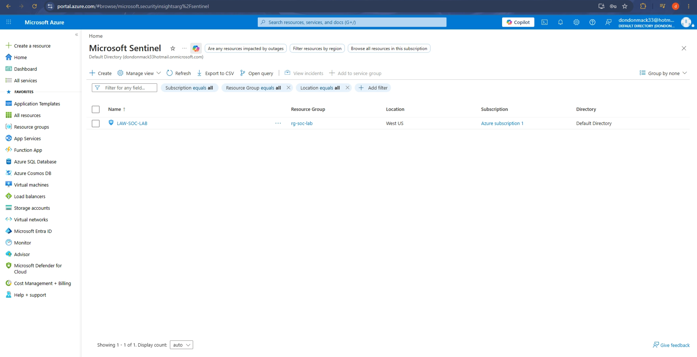
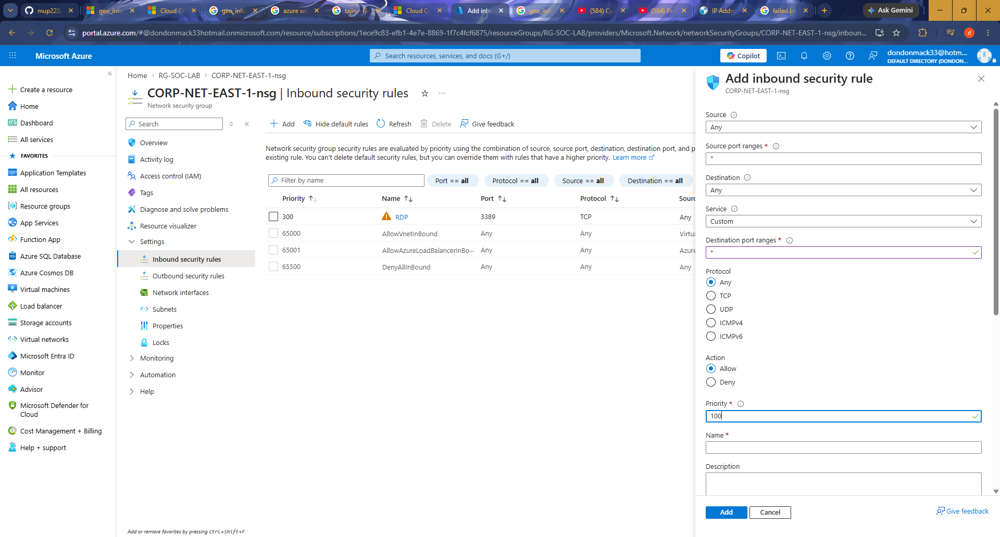
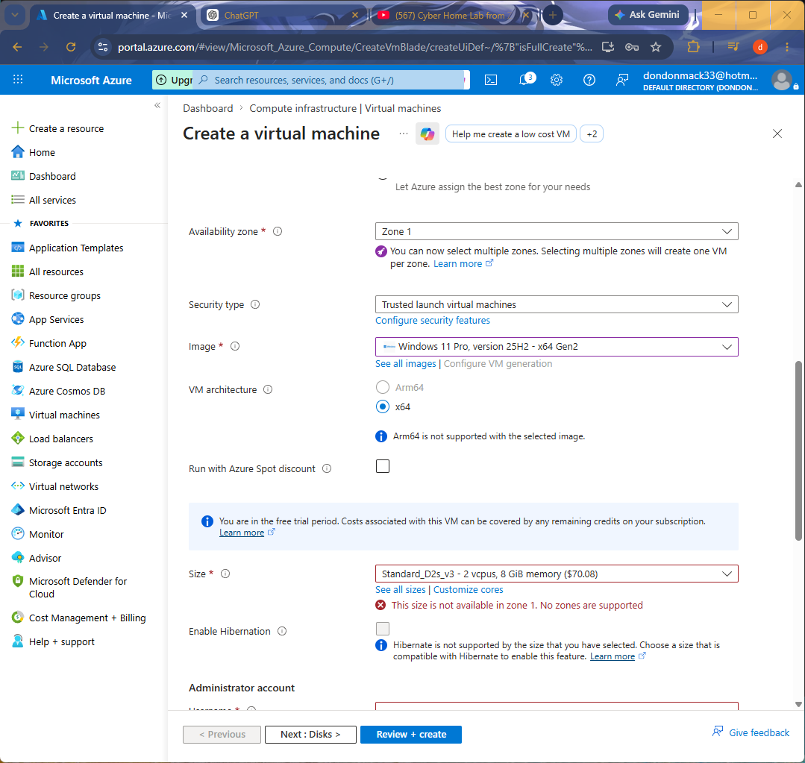
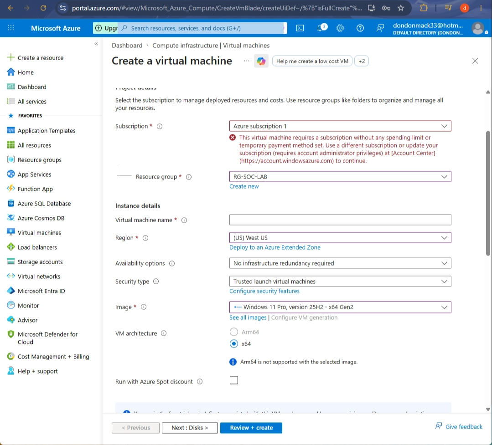

# Azure honeypot lab

This documentation walks through the process of building a basic SOC lab in Microsoft Azure using a Windows honeypot, Microsoft Sentinel (SIEM), and Azure Log Analytics. The goal is to create an intentionally exposed virtual machine that attracts malicious login attempts, collect the resulting security logs, and analyze them using Kusto Query Language (KQL). Throughout this lab, you'll configure the required Azure resources, connect log sources to Microsoft Sentinel, and observe real-world attack activity. While these steps closely follow the original lab instructions, some configurations and naming conventions may be adjusted as needed.



# Instructions

Create a free azure account using the following link:

https://azure.microsoft.com/en-us/pricing/purchase-options/azure-account

## Create a Resource Group

First we will create a resource group. This houses all of the resources we will utilize in azure in 1 environment.

- Go to the search bar and lookup Resource Groups → Create
- Configure Resource Group
    - Choose subscription (If this is your first it will be Azure Subscription 1)
    - Resource group name : RG-SOC-Lab (Choose a name you want)
    - Region: West US
- Review and Create → Create
- Refresh your tab or go to a different tab and come back to view the new resource group you created.




## Create Virtual network

- Go to the search bar and lookup Virtual Networks → Create
- Configure virtual network
    - Choose subscription: Azure Subscription 1
    - Resource group: The resource group you just created
    - Virtual network name: VN-SOC-LAB
    - Region: West US
- Review and Create → Create
- Verify the Virtual Network has been deployed via a confirmation screen


## Create a VM (honeypot)

- Go to the search bar and lookup Virtual Machines → Create → Virtual machine
- Configure Virtual Machine
    - Choose subscription: Azure Subscription 1
    - Region: EAST-US-2
    - Resource Group RG-SOC-LAB
    - Virtual machine name: CORP-NET-EAST-1 (Name it something that sound important to attract attackers)
    - Image: windows 11 pro version 25H2 x64
    - Size: D2s_v3 (WARNING!!! Turn it off when your done or you will be charged when resources go over)
    - Pick a username and secure password (Do not make your name the username)
    - Check the licensing box on the bottom
    - Click next and navigate to the networking tab. Select Delete public IP and NIC when VM is deleted.
    - Click next and disable boot diagnostics (Not need for the lab and saves cost)
    - Continue to the end and create

I choose the D2s_v3 because it was the default size given for the image and it suits my purposes. The size and memory is recommended for a fast general purpose system on the cloud. Additionally Boot diagnostics is not need for this project so removing it saves cost on azure.


## Configuring Log repository (Log analytic workspace)

Next we will create and configure the log repository. This will store the logs from the VM.

- Search Log analytic workspace → Create
    - Same subscription
    - Same resource group
    - Log repository name: LAW-soc-lab
    - Region: West-US
- Create





## Create a sentinel  (Microsoft SIEM)

- Search Microsoft Sentinel - create
- Select the Login analytics workspace you created then select add at the bottom





## Azure monitoring agent security event connector

We will next create a security event coordinator. This connects the VM to all the log analytics workspace allowing all of the logs to be accessible from the log repository.

- Go to your sentinel → Content management → Content hub
    - if you see Click to go to defender portal select it then Content management → Content hub
- Search for windows security events → install
- Select Windows Security events via AMA → Click on open connector page → Create Data collection rule(Used to forward logs so it can be viewed in SIEM)
    - DCR-RULE
    - expand and select VM for resources
    - Collect all event
    - Then create
- Go to VM →Settings → Extensions and applications
    - check for the azure monitoring windows agent to verify.




## Map visulization

Next we will create a map visualization using azure workbooks. This will translate the failed login attempts to a location on the map.

- Search for Azure workbooks → Create → Dashboard (Preview) →


## Map Visualization

We will now create a visual interface using Azures map visualization in order to view the geolocations of the login logs.

- Search Azure Workbooks → Create → New → Add → Add query


Use the following query:

```jsx
SecurityEvent
| where EventID == '4625'
| extend GeoInfo = geo_info_from_ip_address(IpAddress)
| extend Country = tostring(parse_json(GeoInfo).country)
| extend City = tostring(parse_json(GeoInfo).city)
| extend Latitude = toreal(parse_json(GeoInfo).latitude)
| extend Longitude = toreal(parse_json(GeoInfo).longitude)
| summarize count() by Country,Latitude,Longitude
```

- For data source and resource types select log analytics.
- Select load all subscriptions → your log analytic workspace
- Visualization: map
- size: large
- Select map settings and configure it with the following settings:
    - Latitude: Latitude
    - Longitude: Longitude
    - Size by: count_
    - Color by: Count
    - Metric label: Country
    - Metric Value: count_
    - Leave everything else default. Feel free to customize coloring type and palette.
- Select Apply → Save and close → Done editing
- To save select the save icon
    - Resource group: RG-SOC-LAB
    - Name: AM-SOC-LAB


## Open the firewall

I left this step for the last due to its cost on your azure subscription. Be sure you understand how to turn off and delete your system before proceeding.

- Navigate to your Resource group → Overview and select your Network security group
- Delete RDP security rule
- Navigate to Settings → inbound security rules → add
    - Source any
    - Destination any
    - Destination port ranges any
    - priority 100
    - Name : AnyThingAllowed
- Then add

Disable internal windows Firewall 

While the network protections on azure are now disabled there are still firewall protections locally on the VM windows system.

- Using windows RDP (Windows app on mac) Access the windows system using the public IP.
    - (Note: If you did not record your public ip go to your VM on azure in the overview section)
- Connect via VM public IP address as well as Login credentials
- search wf.msc
- Go to windows defender firewall properties and turn off for each tab (press O to do it) then apply

Verify attackers can access

- Go to your OS command line and ping the public ip





# Common issues

No zones are supported  



This error occurs when Azure can’t supply the VM with specific space on the designated zone or in this case any zone. 

- A possible error is that this VM size isn’t available in this zone. This isn’t the case because if other VM images are selected the error remains.
- Another possible error is that the zone does not have enough compacity to support the deployment of the VM. This issue is the likely case

In order to remediate this error choose another region.

